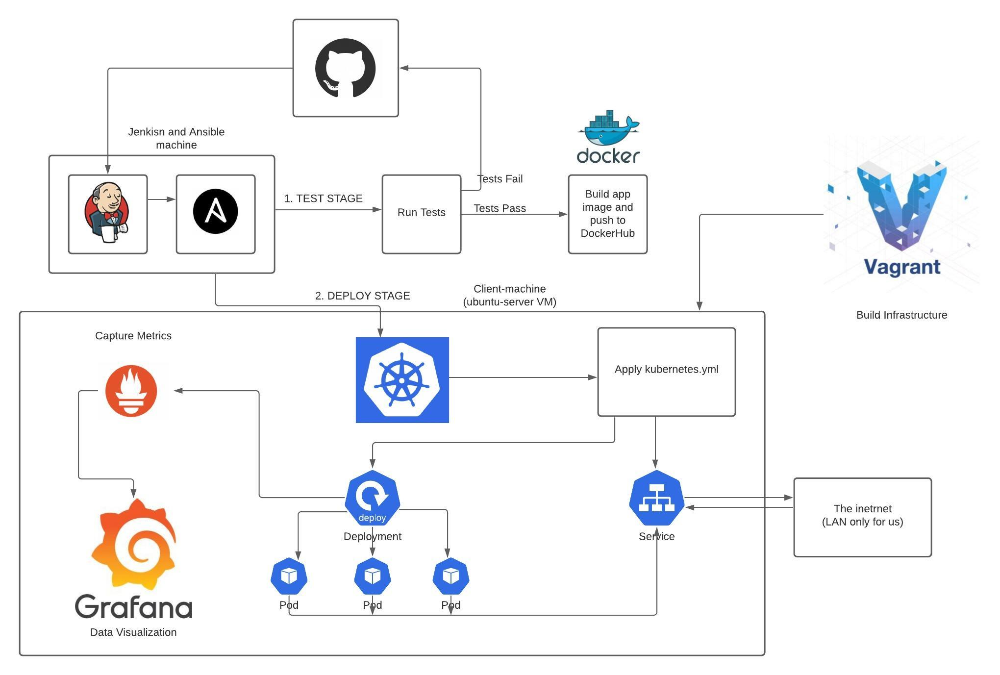

# DevOps-Case-Study-Part-2
 
This repository will act as the final capstone project for the Per Scholas 2020 Cloud DevOps program. Any documentation provided here has a specific purpose to meet the goals and requirements for this project set by Per Scholas and are not indicative of my usual documentation style, but will likely be quite similar. 

I wil cosnider this project a portfolio piece, but may change the name of the repository to indicate that later on.

Additionally, this project is a local deployment of a flask app running on a kubernetes cluster. Meaning it does not utitlize cloud providers such as AWS or GCP. Upon completion of this "local" project I will redo the project with a cloud provider.

## Architecture Overview
 

---
## Environment

### Two VMs

jenkins-master: This VM was created manually through VirtualBox far ahead of this project's creation date. It serves as my all-purpose jenkins machine and will almost always be where my jenkins is run from. I'd like to briefly elaborate on why that is. Given that Jenkins will be repsonsible for running all my pipelines and has a GUI, I would prefer not to host it on a cloud provider as not only would that rack up a large bill whenever I want to do some small project, it is also resource inefficient as my local machine has plenbty of available resources to have Jenkins running basically whenever I am working. I also have opted to NOT dockerize my jenkins as I do not see a large benefit from messing with volume mounts and port fowarding. My jenkins VM only has tools necessary for a jenkins pipeline (like Ansible or Terraform) and I add packages whenever I need them. Given that this is not a production environment I would prefer to not have to drift from a dockerfile that creates a jenkins container by installing new packages manually, or constantly be rebuilding an image. 

Bottom line, I prefer having jenkins run just on a VM.
- Base Image: ubutnu-server-20.04-amd-64
- Provider: VirtualBox
- Provisioner: Manual

case-study-worker: This is another ubuntu-server based VM and will act as my kubernetes control node.
- Base Image: peru/ubuntu-20.04-server-amd64 (Obtiained through Vagrant registry)
- Provider: VirtualBox
- Provisioner: Vagrant [Vagrantfile Link](./vagrant/Vagrantfile)

## Stage 1: Setup worker VM
The first step, besides documentation, is to provision a VM for our ansible to target, install necessary packages, and apply a deployemtn and service to a cluster, but that will coem later.

For now we simply navigate to the directory with the aformentioned Vagrantfile and run the following command 
```
vagrant up
```
Which will provision the virtual machine, and install our kubernetes cluster provider. Here is a snippet from my vagrantfile that show the pakcages to install upon creation
```
config.vm.provision "shell", inline: <<-SHELL
    apt-get update
    apt install snapd -y
    snap install microk8s --classic
    apt install net-tools -y
  SHELL
```
Microk8s is our cluster provider and requires the snapd package to install.

Vagrant will handle all the heavy lifting and should install all packages mentioned above.

Some manual configuration is required after this step, such as changing the default password. It is also helpful to run an `ifconfig` and note the fresh VMs IP address.

Further Microk8s configuration will be done later.

## Stage 2: Create Jenkinsfile
Because most, if not all, our configurations are being done through an ansible playbook and roles, all we need jenkins to do is call the playbook. 

While this projects [Jenkinsfile](./Jenkinsfile) is not at all complex, they can quickly become complex when the pipeline calls for things such as testing, which calls for a new environment (such as a docker container) to be created and the application (our flask app) to be run against test cases.

For this application there are no test cases, so we do not need to include this step, but it is good practice to mock it out anyway.

## Stage 3: Setup Microk8s 
#### (Note: This is the most basic overview of the necessary steps and is not a replacement for following documentation)

Make sure the Microk8s service is running with
```
microk8s start
```

Then enable the DNS addon which we will need to access the service we will set up soon
```
microk8s enable dns
```

These steps, among others, are covered in the [Microk8s ansible playbook](./ansible/roles/microk8s/tasks/main.yml).

Now let's run our Jenkins pipeline and see what happens!


Our Jenkins build was a success, but that doesn't necessarily mean our deployment was applied, so let's check on our cluster.

`microk8s kubectl get all -n default`

Gives us an output of:


Now we have confirmed our flask app is runnig on three pods and has a service to expose it with the IP of this machine at port `30785`


## Stage 4: Monitoring
Monitoring is very important, especially for applications or services that need high uptime. 

Let's make sure our monitoring services are also running in our microk8s cluster by running this command:
```
microk8s kubectl get all -n monitoring
```

Our output should look like this:


This may seem like a lot, but really we are just looking for `service/prometheus-k8s` and `service/grafana` to be up and running!

### Why We Need Monitoring

While kubernetes allows us to have multiple linked instances of an application running and accesible with a single IP address (or more depending on your configuration, but that's not important right now) it still is limited by the hardware resources available on a node.

Because of this limitation, among other reasons, we want to have real-time tracking of things like CPU and memory utilization, network traffic, and pod availability. This is where tools such as Prometheus or Elasticsearch come into play.

These tools constantly gather metrics about what your application is doing and what network traffic is hitting it. Cool right? But now that we have all this data, how can we use it in our decision making? Enter: Grafana

Data visualization tools such as Grafana or Kibana query tools like Prometheus and Elasticsearch (which only collect and store the data) and display them in human usable format. For example, by constantly refereshing my flask web application, I am hitting it with a lot fo traffic all at once, we can see that here


Grafana even shows the dispersal between pods!

Here is a look at the system utilization as well


However, this system utilisation view is more about how much of each *containers* allocated system resources. If we want to see the system's (or in this case a VM) resource utilization, we cna use a tool like top, or vtop, or gtop, or atop.... there are a lot of tops. I prefer glances!


We can clearly see that some snap services are hogging all our resources! As microk8s comes form the snap package repo, we can once again confirm our cluster is at least running.

## Final Thoughts and Issues

### Elk/Elastic stack

The original monitoring stack I planned to use proved to be too much hassle to configure.

#### Issue 1: Exposing servers publically
In order for a non-local machine to access the elasticsearch server, a non-loopback address is required in the `elasticsearch.yml` configuration file. This same thing can be said for the Kibana configuration as well.

#### Issue 2: kubernetes module configuration
While many modules available for the various types of beats in the Elastic stack are fairly straightforward to setup and configure, the kubernetes module is not. While it is very much possible, it is an enormous headache and so I made the switch prometheus + grafana as it would have taken more time than alotted to implement.

### Ansible + Jenkins

This is less of an issue and more of a quirk-and-or-feature of jenkins.

The ansible tool required a valid ssh key-pair setup between where ansible is installed and where it will target commands. This is still true when targeting the same machine ansible is on.

While this is quick and easy to setup, once you involve jenkins, you must start thinking about how the tools interact. Something that is not made clear in any jenkins "Getting Started" guide is that all jenkins pipelines are by default executed as the "jenkins" user, not the user profile you save credentials for to log in to the dashboard and interact with the CLI. This is a user on your OS that is created during jenkins installation. 

The easiest solution for this is to create the ssh-keys for the jenkins user and adding it to the target machines `authorized_keys` file in the `.ssh` directory, usually found in the user's home, but found under `/var/lib/jenkins` int he case of the jenkins user.

---
### End of File